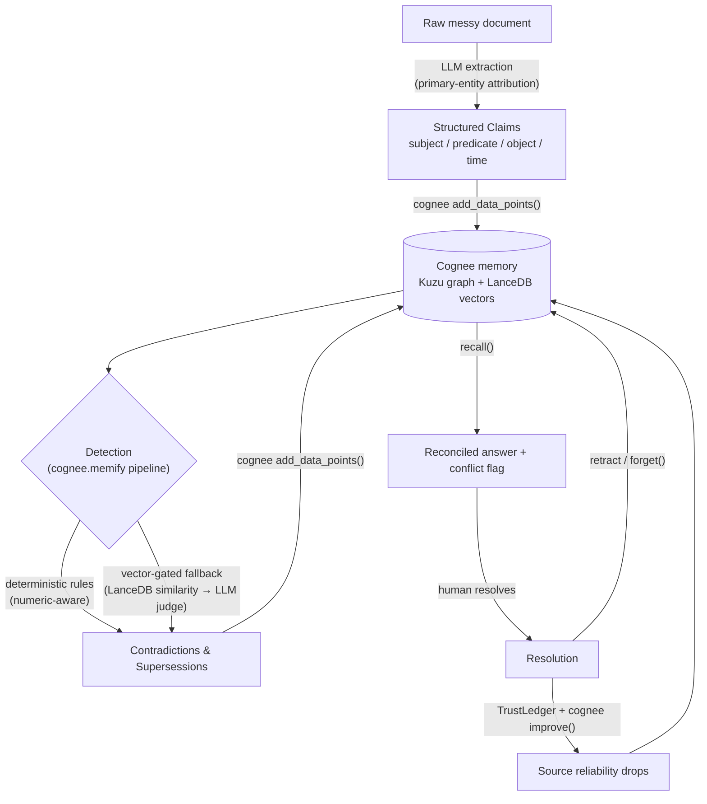

# Coherence

**A consistency layer for AI memory.**

Cognee gives an agent perfect recall. Coherence keeps that recall honest: it catches the moments when the memory contradicts itself, and stops the agent from acting on the confusion.

Built for *The Hangover Part AI: Where's My Context?* — the WeMakeDevs hackathon with Cognee. Open-source track.

`16 tests green · 100% detection over 36 judgments in 8 domains · guardrail 16/16 · runs at $0`

[🎥 Demo Video](https://youtu.be/lvSJoSXj3vk) · [💻 GitHub Repository](https://github.com/Joker2841/coherence)

---

## The problem nobody checks for

Give an agent a memory layer and it stops forgetting. That's the easy win. The quiet problem is that "remembers everything" also means "remembers contradictions."

Two lab charts that disagree on a patient's blood type. Two reports with different Q3 revenue. A fact that was true in March and wrong by June. The memory holds all of it, and nothing tells you the story no longer adds up.

We checked this on plain Cognee, and whether it flags a conflict at all depends on the model. Ask for a patient's blood type when the two charts disagree. On one model it silently answered `A+` and stated it as fact. On three others it noticed the disagreement but left it sitting in prose: *"ambiguous between O+ and A+."* Sometimes the conflict surfaces, sometimes it doesn't, and it never comes back as anything an agent can act on. One is a silent coin-flip; the other is prose that still can't tell you which chart to trust.

That gap is what Coherence closes, and it closes it the same way every time. The check that flags the conflict is deterministic and never calls an LLM. The same charts always produce the same block, on every model we tried. No coin-flip, no prose to read, just one structured stop.

We ran this across four model backends: Groq, Gemini, Ollama, and OpenRouter (poolside/laguna-xs-2.1). Plain Cognee's answer changed with each one. Coherence's block did not.

## What it does

Coherence is a thin integrity layer on top of Cognee. It reads claims into Cognee's graph-vector memory, finds the contradictions and the beliefs that have gone stale, and refuses to let an agent act while the relevant memory is in conflict. A human resolves the conflict, the system learns which source was unreliable, and the memory clears.

## The 20 seconds that explain the whole thing

```
[agent]  What blood type should I order for patient_017's transfusion?
[coherence] BLOCKED -- refusing to act on patient_017.blood_type:
    [!] patient_017.blood_type is both 'O+' and 'A+' at 2024-01-05T09:00:00.
    Conflicting records; human review required before proceeding.

--- a nurse checks the wristband ---
[human]  Chart A (O+) is correct. Retracting Chart B (A+).

[agent]  What blood type should I order for patient_017's transfusion?
[coherence] CLEAR -- no unresolved conflict on patient_017.blood_type.
[agent]     Proceeding: O+
```

An assistant about to order the wrong blood type, stopped cold, then cleared once the right chart is confirmed. Run it yourself: `python scripts/run_guardrail.py`.

---

## How it works



A couple of design choices worth calling out.

**Why a graph and not just vectors.** Similarity search can't spot a contradiction once the wording changes. A graph can, because two claims that share a subject and predicate but disagree on the value are a structural relationship, not a distance in vector space. That structure is also what makes the numeric check possible: `$5M` and `$5,000,000` are the same fact, so we don't flag them; `$5M` and `$7M` are not, so we do.

**The LLM is a fallback, not the engine.** Exact rules resolve the clear-cut conflicts with zero model calls. Only the genuinely ambiguous cross-predicate cases (like "vegetarian" versus "ordered a steak") reach the LLM, and only after a vector gate filters the candidates. On the eval suite, every conflict is caught deterministically. Where the model *is* needed, the gate cut candidate pairs from 11 down to 1.

## What we actually use from Cognee

| Capability | How Coherence uses it |
| --- | --- |
| DataPoint subclasses | `Claim` and `Contradiction` are first-class graph nodes with vector-indexed fields |
| `memify()` pipeline | Detection runs as a native `cognee.memify()` task pipeline: a custom extraction task feeds claims, a custom enrichment task writes `Contradiction` nodes back |
| Kuzu + LanceDB store | Graph relationships and vector similarity in one memory layer |
| `add_data_points()` | Structured ingestion of claims and detected conflicts |
| Vector engine search | Drives the fallback gate, filtering candidates before any LLM call |
| `temporal_cognify` | Event-dated edges behind the time-travel view |
| `improve()` | Feedback-weight reweighting on each resolution |
| `session.add_feedback` | Verified the recall → feedback → reweight loop end to end |
| `forget()` / `prune` | Surgical retract on resolution, and a clean reset |
| `LLMGateway` | Structured output for both extraction and the semantic judge |

## The numbers, with denominators

We were strict about this. Every claim below re-runs from the repo (see *Reproduce* below), and every one is measured against hand-labeled ground truth.

| | Result |
| --- | --- |
| Unit tests | 15 passing (detection rules, numeric equality, trust math, scoring, the guardrail gate) |
| Detection | 100% precision / recall / F1 over 36 labeled judgments across 8 domains |
| Guardrail | Correct on 16/16 agent-action decisions across 6 domains: blocked every contradiction, allowed every clean or already-reconciled one |
| Extraction (raw text → claims) | 85–96% recall across 5 domains, holding on 3 different models |
| Numeric handling | `$5M` == `$5,000,000` (not flagged); `$5M` vs `$7M` (flagged) |

The 16/16 matters more than the block count. A gate that refuses everything is useless. The point is that it lets the safe and reconciled actions through and only stops the real conflicts.

## Reproduce

Stop the API server first (it shares the embedded DB lock with the scripts), then:

```bash
chmod +x reproduce.sh && ./reproduce.sh
```

Or check any single claim:

```bash
pytest tests/                                             # 15 passed
python eval/evaluate.py --dataset eval_suite              # P/R/F1 = 1.0
python scripts/run_guardrail_eval.py                      # 16/16 safety decisions
python scripts/run_memify.py doug_witnesses              # 6 conflicts via cognee.memify()
python scripts/run_cost.py agent_memory                   # LLM-call reduction
python eval/evaluate.py --dataset agent_memory --use-llm  # semantic tier: 67% → 100%
python scripts/run_extract_suite.py                       # extraction, 5 domains
```

The first four run fully offline. The last three call an LLM.

## Quickstart

```bash
git clone [FILL_IN: repo link] && cd coherence
python -m venv .venv && source .venv/bin/activate
pip install -r requirements.txt && pip install -e .
cp .env.example .env      # add one free LLM key, see below
uvicorn coherence.server:app --port 8000
```

Everything is self-hosted and free. Kuzu for the graph, LanceDB for vectors, Fastembed for local embeddings, and your choice of LLM: Ollama fully offline, Groq / Gemini on a free tier, or OpenRouter using a Gemini-class model. One thing the config enforces on startup: you have to set both the LLM and the embedding provider, or Cognee silently falls back to paid OpenAI. Coherence refuses to boot if you only set one.

## The interface

Coherence ships with a debugger built as a forensic case board — because a
memory that contradicts itself is a case to solve. Claims land as evidence
slips on a felt table; contradictions are strung together in red, temporal
supersessions in amber. Resolving a conflict stamps the losing claim
**RETRACTED** and seals the survivor.

The metaphor isn't decoration — every action on the board is a real Cognee
operation, and a lifecycle rail across the top lights up which one is firing:
**remember** (`add`) → **detect** (`memify`) → **improve / forget** →
**recall** (`search`). A first-time viewer can watch the memory lifecycle run.

Two cases ship in the board:

- **01 — The Missing Groom.** Six witnesses, conflicting locations, one
  question: where's Doug? The hook.
- **02 — The Agent's Memory.** A temporal supersession plus a
  vegetarian-vs-steak *semantic* conflict — the case that needs the gated LLM
  tier. Toggle the LLM off and recall drops to 67%; the semantic conflict goes
  uncaught. That's the two-tier detector, made visible.

What you can do on it:

- **Run detection** and watch contradictions get strung and flagged, each with
  an audit line explaining *why* it was caught.
- **Resolve** a conflict and watch the consequence cascade — the loser
  retracts, the red string falls, the unreliable source's trust drops, and
  recall reconciles to a single answer.
- **Solve case** to sweep every discrepancy in one pass.
- **Time-travel** the memory: a scrubber steps through the belief state event
  by event, so you can watch the memory hold a confident answer, slip into
  conflict as a contradicting claim arrives, then reconcile.

It runs against the live backend or in a self-contained mock mode with the same
data shapes — the demo has a safety net if the tunnel drops.

<!-- screenshots -->
<!-- screenshots -->


### The Two-Tier Detector in Action
<p align="center">
  
  
</p>
<p align="center">
  <em>Left: With the LLM tier toggled off, semantic contradictions go undetected, leaving recall at 67%. Right: Activating the vector-gated LLM tier catches the semantic clash, lifting recovery metrics to a perfect 100%.</em>
</p>


## Team

- **Sai Girish** — detection engine, Cognee integration, extraction, evaluation, demo
- **Devika** — the debugger interface, time-travel view

## AI assistance

Per the hackathon rules, we're disclosing this openly. The core idea, the architecture, and every design decision are ours. We used an AI coding assistant as a tool during the build. It helped with pair-debugging, some implementation code, UI styling passes, dataset formatting, and drafting parts of these docs. Everything that shipped, we reviewed and own.

## License

MIT